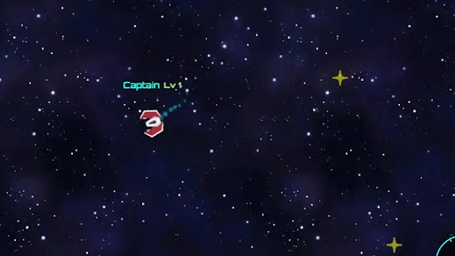
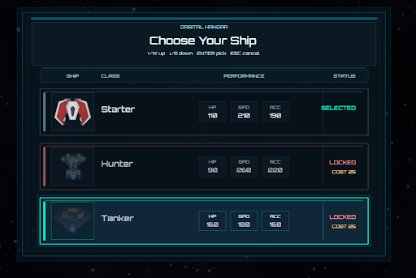
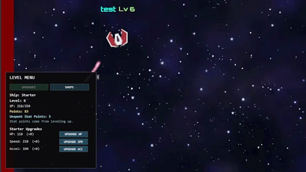
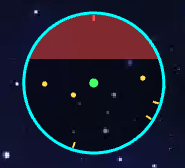

# Hi, I'm Xylia Rippy

I'm a Computer Science student interested in software development, game development, web development, and building projects that are useful, interactive, and creative. I enjoy working on user interfaces, multiplayer systems, and projects that combine programming with visual design.

## About Me

- Computer Science student
- Interested in software engineering, game development, and web development
- Experience with JavaScript, C, Python, HTML/CSS, Node.js, Phaser, and Socket.io
- Currently working on a Capstone project: a multiplayer 2D space arcade game
- I enjoy learning new tools, improving my projects, and building things that people can actually use

## Featured Project: Capstone Multiplayer Space Game

For my Capstone project, I worked on a multiplayer 2D space arcade game built with **Phaser**, **Socket.io**, **Node.js**, **JavaScript**, **HTML**, and **CSS**. The game is browser-based and includes real-time multiplayer movement, ship/class selection, star collection, level progression, UI systems, and minimap features.

This project gave me experience working with a larger codebase, connecting client-side systems together, testing gameplay features, and improving the player experience through UI and gameplay polish.

## Technologies Used

- JavaScript
- Phaser
- Socket.io
- Node.js
- HTML/CSS
- Git/GitHub

## Project Features

- Real-time multiplayer gameplay
- Player movement and server synchronization
- Star collection system
- Ship/class selection
- Level menu and progression UI
- HUD elements for player information
- Minimap for world navigation
- Large 2D space world

## My Contributions

During this project, I helped improve the game's user interface, gameplay flow, and client-side systems. I worked on parts of the level menu, ship selection flow, minimap behavior, HUD updates, and general gameplay testing.

Some of my main contributions included:

- Improving the level menu and ship selection experience
- Working on purchasable ship UI behavior
- Updating minimap indicators for players and stars
- Testing UI and gameplay behavior
- Helping polish the player experience
- Using GitHub branches and commits to manage project changes

## Capstone Screenshots

### Gameplay

### Main Menu

### Level Menu

### Minimap

## Capstone Repository

[View the Capstone Project on GitHub](https://github.com/MasonR03/Capstone_Project)

## Capstone Website (if still opened)
[Orbitfall](https://orbitfall.space)

## Skills

### Programming Languages

- JavaScript
- Python
- C
- Kotlin
- HTML/CSS
- SQL

### Tools and Technologies

- GitHub
- Node.js
- Phaser
- Socket.io
- Google Cloud Platform
- Postman
- VS Code
- Linux/WSL

## Other Project Experience

In addition to my Capstone project, I have worked on projects involving:

- Web APIs and cloud deployment
- Machine learning assignments using Python and Scikit-learn
- C programming and file system simulations
- Android development with Kotlin and Jetpack Compose
- Open source documentation and testing
- Multiplayer and UI-focused game systems

## Goals

I want to continue developing my skills as a software developer and build projects that are clean, useful, and easy to understand. I am especially interested in software engineering, game development, UI systems, and full-stack development.

## Contact

- GitHub: [https://github.com/YOUR-GITHUB-USERNAME](https://github.com/Starlight0218)
- LinkedIn: [YOUR-LINKEDIN-LINK](https://www.linkedin.com/in/xylia-rippy-0a24a12a2/)
